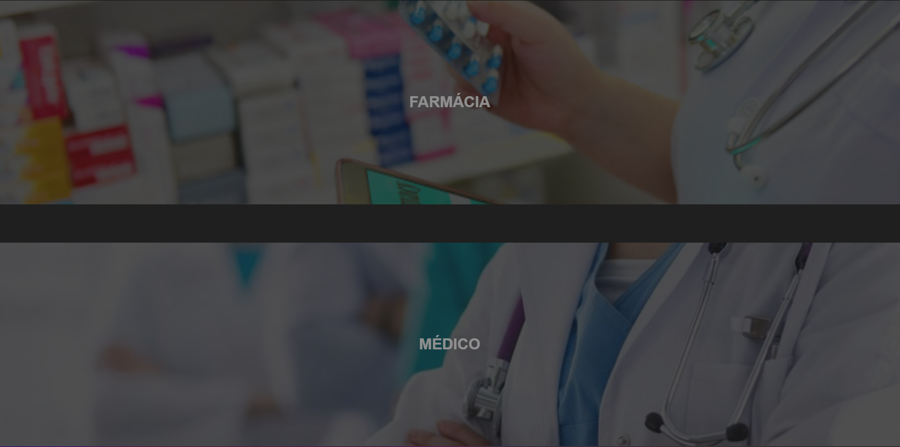

<!DOCTYPE html>
<html lang="en">
<head>
    <meta charset="UTF-8">
    <meta name="viewport" content="width=device-width, initial-scale=1.0">
</head>
<body>
  <h1>Desenvolvimento-Web: Trabalho final</h1>
  <table>
    <tr>
      <td></td>
      <td></td>
      <td></td>
    </tr>
  </table>

  <h2>Descrição do Projeto</h2>
  
Neste projeto, criamos um site para gestão de receitas médicas, onde os médicos podem elaborar receitas e as farmácias podem acessá-las remotamente.

  
Conseguimos concluir as seguintes requisições:

  <ul>
    <li>Tela de login funcional - Integrada com banco de dados.</li>
    <li>Model completa.</li>
    <li>Controller completa.</li>
  </ul>

  
O que foi usado para conclusão da atividade:

  <ul>
    <li>MySQL - Banco de Dados.</li>
    <li>Angular framework - frontend.</li>
    <li>Spring Boot framework - backend.</li>
    <li>Tomcat - servidor web Java.</li>
  </ul>

  <h2>Equipe</h2>
  <ul>
      <li>Victor Scheller Zuccoli</li>
      <li>Igor Fellipe dos Santos Gato</li>
      <li>Diego Vinicius dos Santos</li>
  </ul>

<ul>
  <li><a href="https://drive.google.com/file/d/1ye__9iYdrx5jcRzhsvazQrQOMdNR0BGQ/view?usp=sharing">Vídeo de apresentação</a></li>
  <li><a href="https://drive.google.com/file/d/15zDshWKorpKZfC7k9HybiZsLnDyd_Wcq/view?usp=sharing">Código completo</a></li>
</ul>
</body>
</html>
